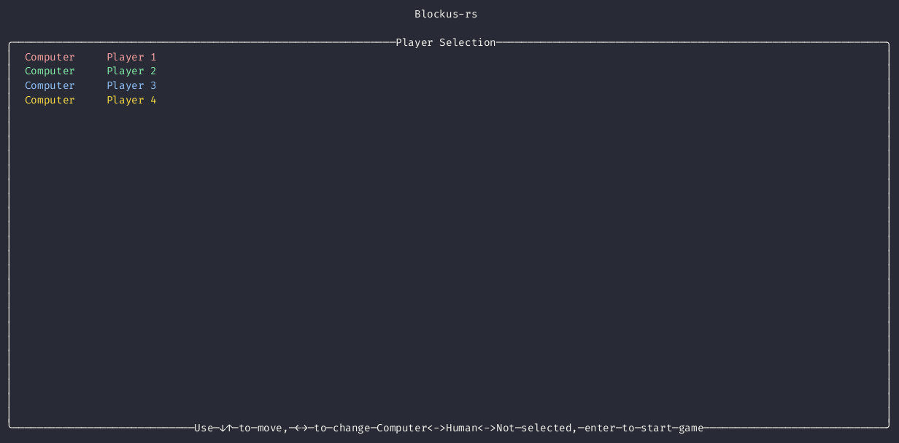

# [Blokus](https://en.wikipedia.org/wiki/Blokus) in the terminal

* 1-4 players (computer/human)
* basic greedy computer algorithm (big blocks first, at the first available position)
* terminal UI using [ratatui](https://github.com/ratatui-org/ratatui)



Recorded by [asciinema](https://github.com/asciinema/asciinema) and converted to gif using [agg](https://github.com/asciinema/agg).

```
asciinema rec --overwrite blockus-rs-demo.cast --command "./target/release/blockus-rs"
agg --speed 0.5 --idle-time-limit 1 --rows 30 blockus-rs-demo.cast blockus-rs-demo.gif
```

## License

Dual-licensed under MIT or the Apache License V2.0.